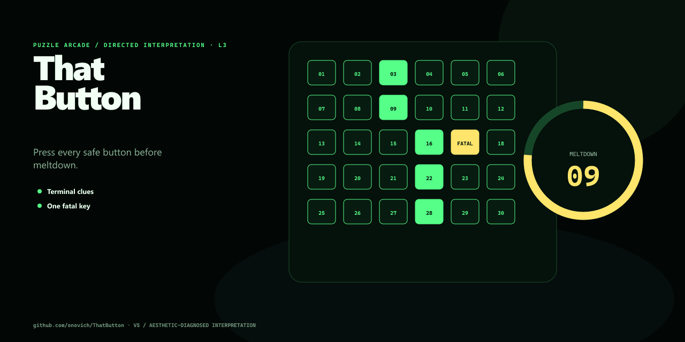

# ThatButton

[简体中文](README.zh-CN.md)

[Play online](https://blog.onovich.com/ThatButton/)

ThatButton is a single-screen puzzle arcade game about reading a terminal clue, identifying the fatal button, and pressing every safe button before the system breaks down.



## How to play

- Read the fatal condition shown by the terminal.
- Press every button that does **not** match that condition.
- Clear the panel before the timer expires.
- Wrong presses damage the player and break the current combo.
- Defeat increasingly dangerous enemies, then choose an upgrade before the next encounter.

Mouse and touch use the same button interface.

## Features

- Data-driven board sizes, timers, fatal conditions, and difficulty bands.
- Combo attacks, enemy health, boss encounters, and deterministic upgrade choices.
- Moving-button and signal-interference hazards introduced after the opening encounters.
- Local best-run records and concise failure recaps.
- Fixed-seed URLs and debug snapshots for reproducible playtests.
- Zero-dependency ES modules and project-owned browser assets.

## Development

ThatButton requires Node.js `20` or later.

```bash
npm run dev
```

On Windows, `StartLocalTest.cmd` starts the local server and opens the game. `OpenOnlineTest.cmd` opens the published build.

Validate and build the static site:

```bash
npm run validate
npm run build
```

Run the focused browser hazard smoke when changing movement or interference behavior:

```bash
npm run smoke:hazards
```

## Project structure

- `src/config/` contains difficulty, combat, encounter, hazard, and upgrade data.
- `src/core/` contains deterministic gameplay rules and state transitions.
- `src/ui/` contains DOM rendering and generated Web Audio feedback.
- `src/host/` contains the versioned, plugin-neutral host boundary.
- `docs/` contains detailed phase reports and playtest evidence.

## Status

The current build contains a complete browser gameplay loop with progression, hazards, local records, scripted validation, and GitHub Pages deployment. It remains a compact prototype: real-device mobile testing and broader player playtests are still limited.

## License

No open-source license is currently included in this repository.
