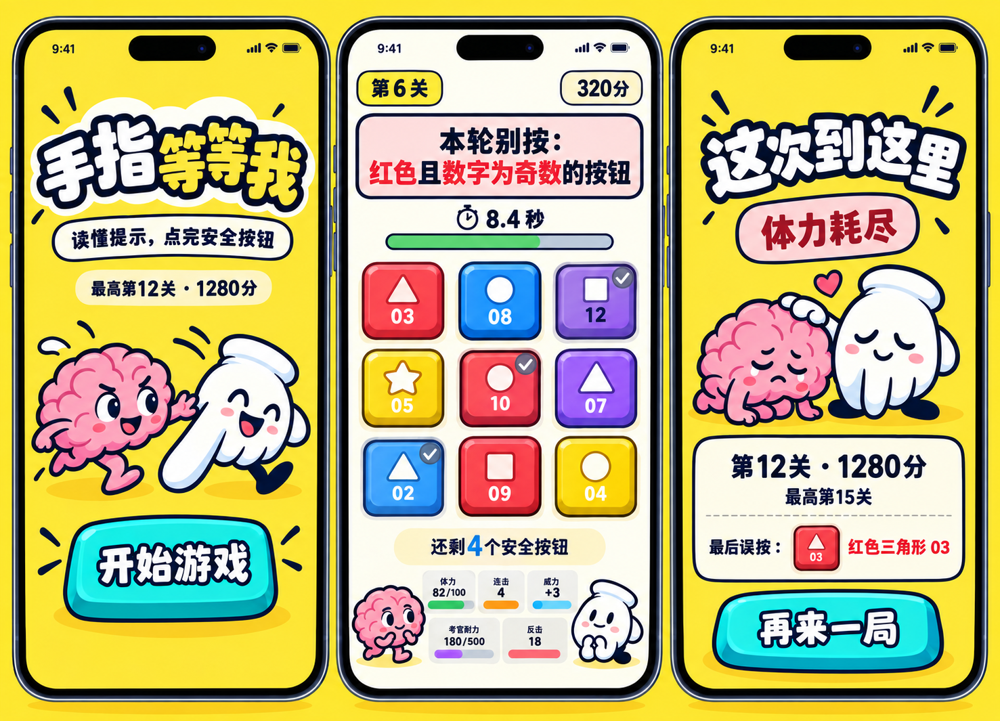
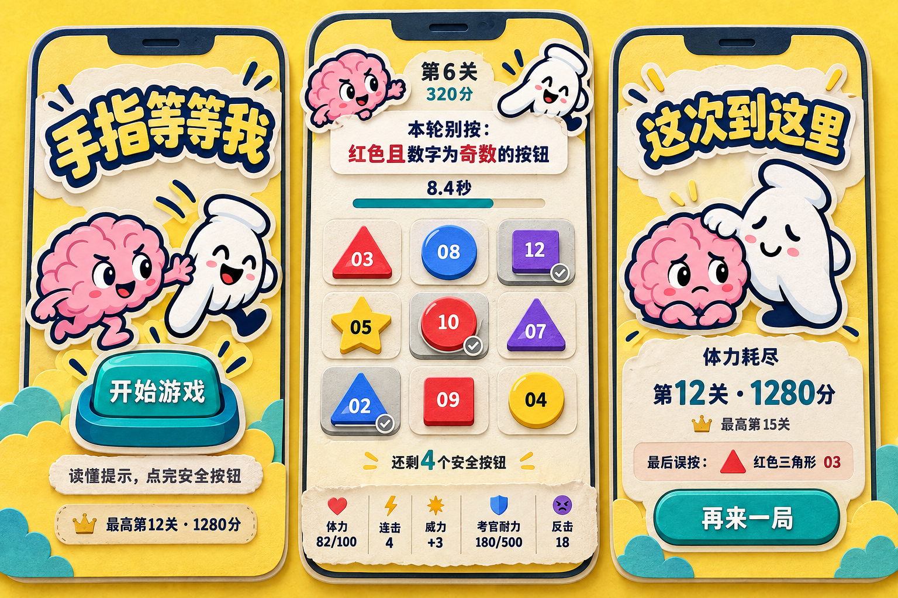
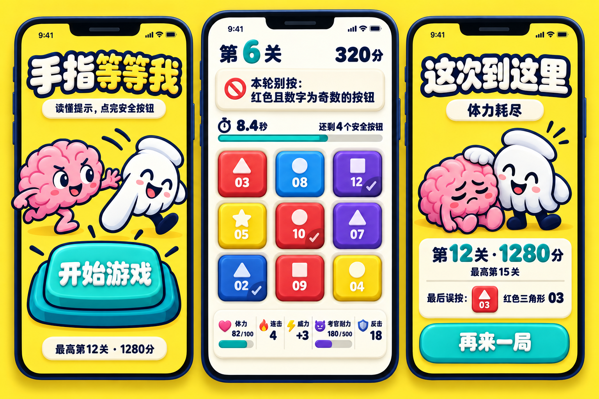
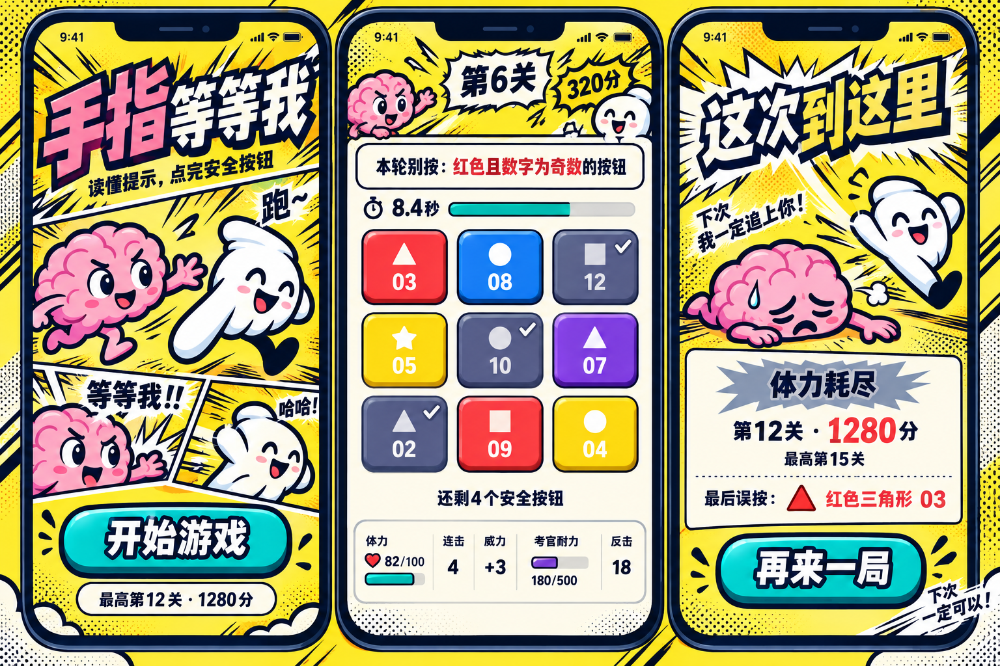

# 手指等等我：四方向原画评审

评审日期：2026-09-29；原画批次：2026-09-28（跨日完成）  
基准：[品牌说明](WECHAT_BRAND_BRIEF.md) · [整体形象与 UI 构想](WECHAT_ART_UI_CONCEPT.md)  
设计会话：`01a0e8b4-38d9-7de1-9915-e7c08cc95a3d`

## 评审范围

四稿采用同一组重点画面：首页、复杂 3×3 局内、结算。原画会话通过 imagegen 生成四张设计板；本评审会话已逐张实际查看原图，分别判断适合继承的设计与落地前要修正的问题。四张原图均保存在[本批次资源目录](../ports/wechat/assets/concepts/2026-09-28)。

用户所列的“没关系”暂按“美观性”理解。设计评分属于本次项目的定性判断；静态画面可以检验层级、角色和视觉表达，触控命中、动画时序、加载速度与留存需要可玩版本验证。

## 推荐结论

**推荐 A 作为整款游戏的深化基线。** 它与用户已喜欢的头像最连续，角色关系成立，三屏的色彩和粗轮廓能形成稳定品牌，前端实现代价也较容易控制。

A、B 的加权综合分接近，取整均为 85。B 的纸艺完成度和局内信息排布更好，适合追求温暖、细腻的整套替代方向；本项目优先延续现有图标的明快、机灵和弹性，因此选择 A 作为评审推荐。这个选择是设计建议，尚未替用户完成最终定稿。

| 稿件 | 可用性 | 美观性 | 风格辨识度 | 图标契合 | 传播优势 | 加权综合 /100 | 主要用途建议 |
|---|---:|---:|---:|---:|---:|---:|---|
| [A · 赛璐璐搭档剧场](../ports/wechat/assets/concepts/2026-09-28/A-cel-stage.png) | 7.5 | 8.5 | 8.5 | **9.5** | 8.5 | **85** | 整体 UI 与角色方向首选 |
| [B · 纸片贴纸桌面](../ports/wechat/assets/concepts/2026-09-28/B-paper-stage.png) | **8.0** | **9.0** | 9.0 | 8.5 | 8.0 | **85** | 整套备选；借鉴状态栏、黄底深字 |
| [C · 软胶玩具按钮](../ports/wechat/assets/concepts/2026-09-28/C-soft-toy.png) | 7.5 | 8.5 | 7.5 | 8.5 | 8.5 | **81** | 借鉴按钮厚度、下沉与回弹期待 |
| [D · 动态漫画节奏](../ports/wechat/assets/concepts/2026-09-28/D-comic-rhythm.png) | 7.0 | 8.0 | **9.5** | 8.0 | **9.0** | **80** | 宣传分镜、短暂过轮与成绩演出 |

单项均为 10 分制；综合分按下文权重计算并四舍五入。实现代价另列，不藏入评分。传播优势是视觉条件评估，尚无点击率、分享率或留存数据。

### 建议如何深化 A

- 保留 A 的角色比例、追赶与照应关系、明黄首页/浅色局内、深蓝轮廓。
- 采用 B 的信息排布思路：减少无意义进度条，黄色按钮使用深字。组件最终仍按 A 的线条与厚度重画，保持统一。
- 借鉴 C 的按压结构：按钮面、底座与投影分层，让按下和回弹有物理依据。
- D 的分镜、速度线和短对白用于首页宣传或过轮演出，局内规则与棋盘保持稳定。
- 下一张深化稿优先解决 **信息完整的 3×3 局内页**：状态字号、连击窗口、黄字对比、正确完成态和短屏布局。它比继续增加装饰更能决定能否落地。

## 评分方法

每项 0–10 分，以 0.5 分为步进；综合分按权重换算为 100 分。权重优先满足清楚可玩与用户已喜欢的图标气质。

| 维度 | 权重 | 看什么 |
|---|---:|---|
| 可用性 | 30% | 开始入口、规则与棋盘层级；按钮属性、完成状态和数值语义；屏幕空间与潜在误触 |
| 美观性 | 20% | 构图、色彩、比例、线条与材质的完成度；装饰是否有秩序 |
| 风格辨识度 | 15% | 去掉标题后是否还能记住这款游戏；三个页面是否属于同一套语言 |
| 图标气质契合度 | 25% | 粉色大脑、白手套手指、黄/青/深蓝配色，以及两位搭档轻快而机灵的关系 |
| 传播优势 | 10% | 入口易懂、缩略图清楚、角色可记、按钮让人想按、成绩与表情容易转述 |

8–10 分代表该维度已具有鲜明优势，仍需按实际问题精修；6–7.5 分代表方向成立但有明显落地障碍；低于 6 分需要重做该维度的关键设计。综合分不替代单项问题清单，规则误导等问题必须单独修正。

### “传播优势”怎样判断

以下五项各占 2 分：

1. 几秒内理解开始入口与主要动作。
2. 缩小后仍看得见角色、按钮与主体层级。
3. 脑手搭档有明确关系和记忆点。
4. 按钮外形能传达按下、回弹与反馈的期待。
5. 结算成绩与角色反应能组成容易理解、愿意转述的小故事。

这些是本项目从平台传播场景和设计实践中推导出的评审指标，不是爆款概率或用户实验结果。

## 参考依据与使用边界

- 腾讯 2026-08-20 的平台介绍指出，小游戏在聊天、搜索等日常入口被发现，提供即点即玩的体验，社交互动参与了传播与回流。因此本次看重小尺寸识别、清楚入口与可转述的画面。[腾讯：微信小游戏如何拉近人与人之间的距离](https://www.tencent.com/zh-cn/how-weixin-mini-games-bring-people-together/)
- 腾讯 ISUX 的游园会案例强调统一的轻量视觉语言、功能入口与内容对应、小尺寸图形精简，以及及时的操作反馈。本次据此检查界面层级、角色贯穿和按钮状态。[腾讯 ISUX：停不下的游园会](https://isux.tencent.com/articles/fudai.html)
- 腾讯 ISUX 的短视频游戏案例讨论明确游戏目标、情绪阶段与画面反馈。本次借用其目标清晰和反馈随状态变化的思路。[腾讯 ISUX：社交短视频游戏的品效合一设定](https://isux.tencent.com/articles/video-game.html)

后两项分别为 2019、2018 年的设计方法案例，不能据此宣称某种画风正在当前榜单领先。四稿不通过“与某个爆款长得像”获得加分。

## 各稿结论与图像

### A · 明亮 2D 赛璐璐搭档剧场

**值得保留：**名称、脑手追赶关系、明黄/粉/青/深蓝配色延续了原图标。首页开始按钮醒目；局内浅底、规则卡与棋盘形成清晰层级；结束时手指安慰大脑，角色关系友好而具体。三屏有统一的粗轮廓和按钮厚度。

**玩法核对：**局内红色 03、09 符合禁止条件；紫色 12、红色 10、蓝色 02 已完成，其余四枚为未完成安全按钮，“还剩 4 个”自洽。没有通过边框预先标出未按下的安全答案。

**落地前精修：**

- 下方五个数值块字体偏小，两个角色又占用了状态区宽度。窄屏先重排数值，再缩角色。
- “反击 18”和“威力 +3”下方画了条状刻度，容易让人误以为这些静态值还存在另一种进度。静态值用数字；连击窗口保留独立、明确的时间表达。
- 黄色按钮上的白数字对比偏弱；需要更可靠的深色文字或深底。
- 结算仅给出最后误按的按钮，还需显示当时规则，才能解释为什么错。

**实现代价：中低。** 基础面板与按钮可用 Canvas 几何绘制，配合少量角色帧。文字与状态需重建为可适配组件；成图中的手机框和系统状态栏只用于展示。

### B · 纸片贴纸桌面

**值得保留：**撕边、贴纸轮廓、纸纹与浅投影贯穿三屏，画面完成度高。脑手搭档的追赶与安慰仍然清楚。局内状态区比 A 整齐，黄色按钮采用深色数字，易读性更好。

**玩法核对：**题目与 A 一致，已完成格用灰底和对勾表达，仍保留原颜色、形状和数字；“还剩 4 个”成立。下方静态数值没有附加不明含义的进度条。

**落地前精修：**

- 连击只显示次数，需补充真实窗口的剩余时间或到期提示。
- 三角形、星形、圆形按钮的实体面积不同；前端应明确统一方格命中范围，避免尖角附近难点中。
- 局内顶部角色占幅较大，短屏需缩为角标，优先保证棋盘与状态文字。
- 纸纹和毛边用于表面与边缘，数字、规则由清楚的实时文字绘制。
- 结算同样需要补充最后规则。首页与结算偏温暖、安静，后续用短促动作与声音表达限时挑战的节奏。

**实现代价：中。** 纸纹与撕边需要可伸缩或分层素材。原画中的形状按钮保留为视觉，命中仍以清晰的棋盘格组织。

### C · 软胶玩具与积木按钮

**值得保留：**主入口和九宫格有很明确的圆润厚度与按压期待，触感表达最突出。棋盘保持正视，规则与倒计时仍清楚；名称、黄色底与脑手搭档延续。进度条仅用于体力和考官耐力，比 A 的数值条更有明确含义。

**玩法核对：**与 A、B 使用同一组按钮和完成状态，剩余四枚安全按钮的示例成立。完成态有对勾，未完成按钮没有额外的安全提示。

**落地前精修：**

- 黄色按钮上的白色形状、数字与高光叠加，对比偏弱，需要深色信息层。
- 底栏五列和图标较拥挤，“考官耐力”等标签偏小；连击还需增加真实窗口提示。
- 标题可保留凸起字，规则和动态数字应保持清楚的平面字。若每个数字都复制复杂高光，容易增加视觉噪声和实现负担。
- “反击”用了盾牌图标，“考官”用了通用小恶魔图标，可能引出防御数值或传统战斗的预期。改为明确的反击符号与本项目考官形象。
- 结算补充最后规则。软胶圆角是一种常见商业视觉语言，需要继续靠脑手关系建立辨识度。

**实现代价：中高。** 将按钮面、底座、投影与文字分层，统一四属性色和各操作状态。预渲染素材结合 Canvas 即可表达质感，无须据原画直接引入实时 3D。

### D · 动态漫画节奏

**值得保留：**分镜、斜切标题、速度线和角色对白形成四稿中最鲜明的漫画语言。首页把名字展开成短情节，结算的追赶对白容易转述。局内棋盘保持正视与浅底，主要热闹元素集中在外围。

**玩法核对：**未完成的六枚按钮中，红色 03、09 被禁止，其余四枚安全，“还剩 4 个”成立。但三个已完成按钮全部变为灰色，无法从当前画面辨认它们原本的紫、红、蓝属性；这与基准文档保留原属性的要求不符。

**落地前精修：**

- 完成态保留原颜色，通过下沉、轻度减饱和与对勾表达；不能统一替换成灰色。
- 局内关卡、成绩和爆炸框较抢眼，规则被挤成一行；需要降低标题装饰、提高规则层级。
- 黄色按钮白字对比不足；连击只有次数，需增加窗口提示。
- 结算里大脑倒地冒汗、手指笑着跳离，容易被读成一方被丢下。可改为拉一把、扶起或共同再冲一次，保留互相照应的关系。
- 速度线、网点与分镜作为常驻底板较满；优先用于有限区域与短促演出。结算同样补充当时规则。

**实现代价：中。** 漫画边框可分层或程序绘制，重点适配长文本、不同宽度下的裁切和动效密度。

## 选型后的共同落地要求

1. **文字与状态分离。** 标题装饰字可以做固定素材，规则、数字、体力、对手耐力、连击窗口、实际结束原因由前端按真实状态绘制。
2. **按钮组件保持一致。** 保留红、蓝、黄、紫题目属性，默认/按下/完成/错误分别有明确状态；人物与装饰不标出未按下按钮的安全性。
3. **先在真实手机尺寸重排。** 设计板中的手机框、刘海与系统状态栏属于展示包装，实装按宿主安全区处理。先保证规则、棋盘、时间与状态字，再安排角色。
4. **用同一道题核对画面。** 禁止红色奇数；红 03、红 09 不可按。已完成紫 12、红 10、蓝 02；蓝 08、黄 05、紫 07、黄 04 尚未完成，剩余安全按钮数为 4。
5. **角色关系贯穿流程。** 首页有追赶，局内有配合，结算有照应；具体动作由实际事件触发。
6. **结果页补齐解释。** 最后规则与最后操作对应显示，超时、误按耗尽体力、对手反击等原因按真实记录区分。

该清单是评审后的交付要求，当前轮次不包含 UI 实装。
