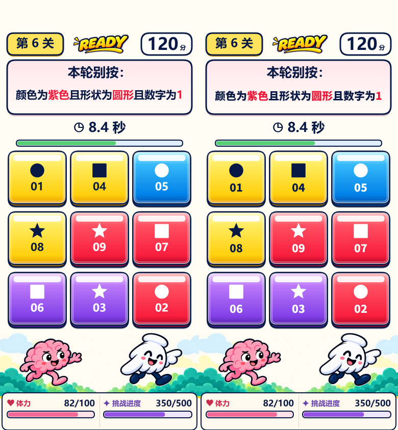

# 预制规则与按钮数字图集：可评审候选

日期：2026-10-02，Asia/Shanghai。业务基线 `89eab01`；不是正式发布。已有绘制合并、测量缓存、暂停调度、glitch 输出缓冲复用均保留，共享 Web 源码未改。

## 当前结论

实现了用户选择的**预先制作有限文字 PNG，运行时直接拼接复用**。没有运行时对字符串 fillText 到离屏 Canvas；没有完整规则/分数枚举，没有历史规则缓存。图集仅为可关闭的内测候选，`ruleAtlas`、`numberAtlas` 默认都关。

Windows 的原字体 Microsoft YaHei 与 Noto Sans CJK SC Black 有字形、笔画和抗锯齿差异。102 个候选对照都存在像素差异，**未通过视觉等价门槛**，不能默认替换，不能宣称完全复原效果。原版在 iOS/Android 会使用不同系统字体回退，图集的跨设备字形固定，但还没有 iPhone/Android 字体外观对照。

这批代码已提供实物对照和回退路径；后续必须先决定可接受的字体来源/外观并实测收益，才可讨论默认开启。未扩展 HUD 固定标签、动态分数/倒计时，也未合成整条规则临时层。

## 基础素材、排版与许可

- 规则来自 `src/core/rules.js` 的 8 常规模板和 1 兜底。16 基础词条组成 24 个不同汉字；图集中有限字符复用，不囤积随机规则。
- rng 的按钮数字实际 1–9，显示 01–09；图集数字 0–9，0 用于前导零。预览的 12 不扩大真实范围；异常/未来数字走原路径。
- 保留原规则逐字宽度、字号适配、按且/或分句、换行行高、整体居中和高亮选择。按钮仍用原字体的整串及前缀宽度确定居中/字距，图集只替换填字。原变换、透明度、呼吸、按下、交换/退场等动画作用于同一绘制位置。
- 位图固定颜色为 `#071944`、`#ec1938`、`#fff`；源字体 63 px，覆盖最高 21 逻辑 px × DPR 3，没有降低主画布 DPR。不同尺寸仍经过原变换缩放，这也会产生抗锯齿差异。
- 源字体为 Noto Sans CJK SC Black 2.004，[固定官方源](https://github.com/notofonts/noto-cjk/blob/f8d157532fbfaeda587e826d4cd5b21a49186f7c/Sans/OTF/SimplifiedChinese/NotoSansCJKsc-Black.otf)及 [SIL OFL 1.1](https://github.com/notofonts/noto-cjk/blob/f8d157532fbfaeda587e826d4cd5b21a49186f7c/Sans/LICENSE)。字体 Copyright 2014–2021 Adobe；随源码与构建保留版权及许可。未将完整字体塞进首包，未采用未知许可的系统字体。
- `assets/text-atlas/README.md`、生成脚本和 manifest 记录固定源提交、SHA-256、字号、基线、字符表及裁切坐标。同机重复生成的 PNG SHA 相同；更换 Chromium/系统后必须重新检查，不能假设 PNG 字节必然相同。

## 内存、加载与构建

单张 864×588 PNG，121,652 字节，RGBA 像素预算 2,032,128 字节，低于 3 MiB 上限。此值是解码像素预算，不是实际宿主/GPU 内存读数。默认关闭时不加载图片；开启任一开关才加载一次，资源替换时释放旧引用并失效当前规则布局及 glitch 画面。

仅缓存一份当前规则布局；不额外合成整条规则位图。图集缺失、尺寸错误、drawImage 异常或词汇超出字符表时回退原 fillText；可选图集加载失败不会阻止已有美术进入游戏。

构建为 **4,156,297 字节**，剩余 **38,007 字节**（4 MiB = 4,194,304）。为容纳图集，esbuild 仅移除 bundle 空白，保留函数名称与语法变换设置；没有删音频/美术。`build.mjs` 和 `check` 均检测实际总文件大小，超限直接报错。生成 bundle 行号已改变，分析新 trace 应按该构建及函数名映射，不复用旧 `label` 行号。

## 自动化证据

| 检查 | 结果及边界 |
| --- | --- |
| 48 个固定 seed/关卡绘制与命中采样 | 1、6、19、28、36、48 关，各 8 seeds；命中位置/按钮 id 一致；缺图绘制命令完全一致 |
| 有限图集调用统计 | fillText 1397 → 576；规则字符命中 429、数字字符命中 784；不是性能时间或调用频率的真机结论 |
| 真实 Canvas2D 102 对照 | 两尺寸 × DPR 1/2/3；54 个规则组合（覆盖 9 模板）及 48 个按下、退场、交换/glitch 时间点 |
| 关闭图集 / 缺图与 `89eab01` | 所有局内对照 0 不同像素；设置页新诊断入口为明确的 UI 新增，不在此零差异声明内 |
| 开启图集与系统字体 | 不同像素范围 3446–59668，包含字形/抗锯齿差异；未通过视觉等价验收 |
| 真实 Canvas 调用合计 | fillText 3300 → 1122；drawImage 432 → 3504。这说明调用种类改变，不说明宿主桥、CPU、GPU 或温度改善 |
| 同 seed / 输入业务状态 | 开始、16/100/16 ms 回调、两次安全点击、误按、12 s 后台等待/继续、重开、超时与存档结果全部相同；固定 Date.now 及 Date 构造时间 |
| 回退 | 缺图、尺寸不符、解码/绘制异常、未知未来词条、资源重载；可选图集失败仍进入主页 |
| 开关隔离 | 规则单独开、数字单独开、均关/均开，互不影响另一绘制路径 |

[完整 JSON 结果](wechat-text-atlas-2026-10-02/results.json)来自 Windows HeadlessChrome 154、Canvas2D、禁用 GPU 的无头比较，不是 iPhone 或 Mac 性能验收。脚本从 Git 读取固定 `89eab01` renderer，不依赖未提交的历史 output 文件。

下图左侧为系统字体基线，右侧为图集候选，390×844，DPR 2；除目标文字外其余画面一致。可观察规则笔画及数字的大小/基线差异。



## 重现与 Mac+iPhone A/B

在 `ports/wechat`：

```text
npm run atlas:prepare   # 无头 Chromium 构建时生成 PNG/manifest；源字体下载到 output
npm run check           # 构建、业务、触摸、诊断、图集及首包预算
npm run atlas:check     # 102 个无头像素对照；结果在根 output/text-atlas-parity
```

根目录仍需 `npm run validate`、`npm run build`。Chrome 不在默认路径时指定 CHROME_PATH。图集生成不是每次 build 的必需步骤；构建复用已提交的素材。

微信开发工具设置编译启动参数（固定同一 seed、设备及测试时间线）：

| 组 | 参数 |
| --- | --- |
| A 基线 | `seed=atlas-ab&perf=1` |
| B 仅规则 | `seed=atlas-ab&perf=1&ruleAtlas=1` |
| C 仅按钮数字 | `seed=atlas-ab&perf=1&numberAtlas=1` |
| D 两者 | `seed=atlas-ab&perf=1&ruleAtlas=1&numberAtlas=1` |

`perf=1` 仅诊断采样，普通玩家无此参数。玩家也可从设置手动开启/关闭诊断；使用步骤以 [内测诊断说明](WECHAT_PLAYTEST_DIAGNOSTICS.md) 为准。记录构建提交、总包字节、设备/工具/基础库/高性能状态；按固定场景分开对比绘制提交耗时、次数、长回调间隔和图集回退。图集命中/回退的单位为字符，不是整串，不要与 fillText 次数直接一对一比较。

先在 iPhone 与 Android 对照同尺寸、同 DPR、同动画时间点的字形/基线/高亮/字距/换行及整体居中；外观未通过就保持关闭。再按 [验收步骤](WECHAT_TEXT_ATLAS_ACCEPTANCE.md) 做普通预览、不挂调试器、不充电的 10–15 分钟电量/体感对照，与连接调试器数据分开。同步检查移动点击/换关/暂停恢复、交换保护与 640 ms 补偿、音频/震动、存档和资源失败。

当前不能给出真实 GPU 呈现 FPS、CPU 百分比或温度收益。iPhone 17 的 48 关/2910 分反馈与合成 trace 的证据边界保持，不归因 VPN、网络 send 或基础库 console 字段。
